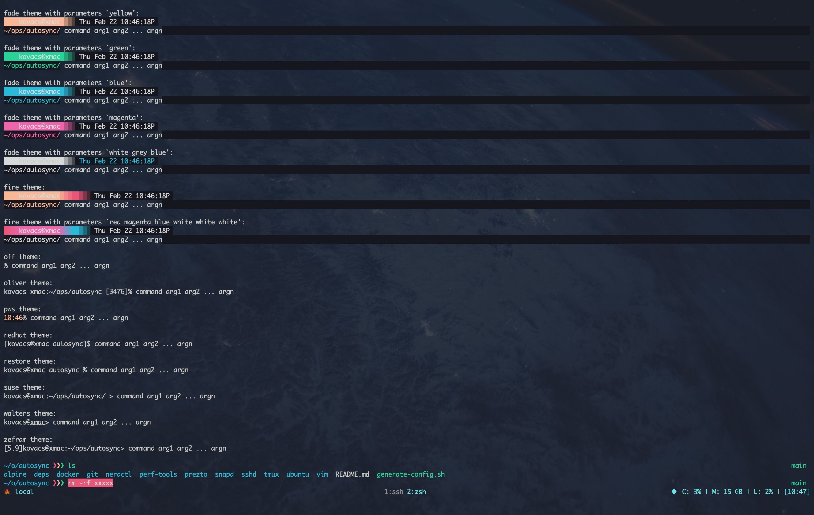
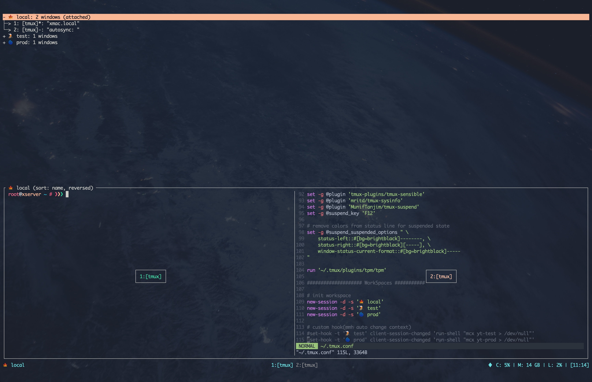

# scripts

## 一、仓库说明

这是一个包含一些自己常用的小脚本发布仓库, 这些脚本大部分用于系统、软件初始化配置; **脚本通过内嵌资源文件的方式实现在网络状况不佳的情况下一次性初始化各种配置**,
本仓库脚本大多数配置文件从 [conf](https://github.com/mritd/conf) 仓库获取并通过 CI 自动发布.

## 二、如何使用

本仓库发布的脚本已经将大多数所需依赖压缩到单个脚本内, 直接下载执行即可:

```sh
curl -fsSL https://github.com/mritd/scripts/releases/download/v1.0.0/prezto.sh > /tmp/prezto.sh
sh /tmp/prezto.sh
```

**注意: 该脚本不支持管道执行, 例如 `curl -fsSL https://github.com..../prezto.sh | sh`.**

## 三、脚本源码

本仓库内脚本通过 [makeself](https://github.com/megastep/makeself) 工具打包, 所以如果担心安全问题或想知道脚本都做了什么, 可以通过以下命令解压脚本:

```sh
root@826833b6769e ~ # ❯❯❯ bash ./prezto.sh --noexec --target ./xxxx
Creating directory ./xxxx
Verifying archive integrity...  100%   MD5 checksums are OK. All good.
Uncompressing Kovacs prezto Config  100%

root@826833b6769e ~ # ❯❯❯ ls xxxx
prezto  dir_colors  install.sh  zpreztorc  zshrc
```

每个脚本解压后都会有一个 `install.sh`, 该内部脚本用于实际安装流程, 查看此脚本即可阅读完整执行流程.

## 四、脚本说明

### 4.1、prezto.sh



该脚本用于初始化 zsh 配置框架 `prezto`, `prezto` 是一个类似 `ohmyzsh` 的 zsh 配置框架, 但比 `ohmyzsh` 速度更快更轻量; **该脚本运行后会安装 `prezto` 并配置 `~/.zshrc`, `~/.zshrc` 目前基本配置逻辑如下:**

- 同时兼容 `macOS` 和 `Linux` 系统
- 默认为所有开发工具(java、go...)等都安装在 `/opt/devtools` 目录
- 自动将 `/opt/devtools/*/bin`、`/opt/devtools/*/sbin`、`/opt/devtools/bin`、`/opt/devtools/sbin` 目录加入到 `PATH` 变量中
- `macOS` 系统下自动将 `brew` 安装的常用工具加入到 `PATH` 中, 例如 `curl`、`mysql-client`、`ruby` 等
- `Linux` 系统下自动设置 locale 相关变量为 `en_US.UTF-8`, 例如 `LANGUAGE`、`LANG`、`LC_ALL` 等
- 对已安装的容器相关的命令自动生成 zsh 补全方法, 例如 `docker`、`podman`、`nerdctl`、`kubectl`、`helm` 等
- **默认将 `~/.user.secret"` 声明为全局变量, 该文件默认不存在, 目的是存放一些个人机密环境变量, 例如 GitHub Token 等**

**脚本配置可能后期调整, 具体请参考 [conf](https://github.com/mritd/conf) 仓库中的配置文件**

### 4.2、vim.sh


该脚本用于初始化 vim 配置, 包括自动安装 [vim-plug](https://github.com/junegunn/vim-plug) 插件管理器以及自动安装一些差价等; 该脚本会自动配置 `~/.vimrc` 文件, 目前 `~/.vimrc` 文件基本配置逻辑如下:

- 加载 `~/.vimrc_plug` 内的常用插件
- 调整一些基础配置, 包括不限于 语法高亮、缩进大小、行号显示、编码等
- 添加自定义命令 `W` 以解决 **编辑特殊文件前忘记使用 `sudo` 而不得不退出然后重新编辑再保存问题**

### 4.3、tmux.sh



该脚本用于初始化 tmux 配置, 主要包括自动安装 [tpm](https://github.com/tmux-plugins/tpm) 插件管理器以及自动安装一些 tmux 插件; 该脚本会自动配置 `~/.tmux.conf` 文件, 目前 `~/.tmux.conf` 文件基本配置逻辑如下:

- **默认前缀按键更换为 `Ctrl+s`**
- 开启 `OSC 52` 支持
- 调整窗口样式, 包括不限于自动标题、左右状态栏显示等
- 安装常用插件, 将暂停插件快捷键更换为 `F12`(一般用于多 tmux 嵌套)
- 默认创建三个 session `🍁 local`、`🌋 test`、`🌀 prod`

### 4.4、docker.sh

该脚本用于自动安装 docker 以及 docker 插件(composes、buildx 等), 同时该脚本将会自动配置 `/etc/docker/daemon.json` 文件, 目前针对 docker daemon 的配置逻辑如下:

- 默认开启 init 支持, 防止容器产生僵尸进程
- 切换 docker 存储目录为 `/data/docker`, 此后所有 docker 数据将会存放于此
- 限制容器日志文件大小, 单个容器最多 5 个日志文件, 单个日志文件最大 10m, 防止容器 stdout 过量输出导致占满磁盘空间
- 开启 `live-restore` 防止 docker daemon 意外重启导致容器重启
- `Debian`、`Redhat` 系列系统默认 CGroups Driver 切换为 `systemd`, `Alpine` 系统保持默认 `cgroupfs v2`

该脚本安装完成后默认会 Pin 住 docker 相关软件包, 防止自动升级导致容器重启或出现不可逆故障.

### 4.5、sshd.sh

> **⚠️⚠️⚠️ 注意: 该脚本会将本人的 ssh key 写入 `/root/.ssh/authorized_keys`!!! 执行脚本初始化后请删除, 否则我可以无需密码登陆你的服务器!!!** 该操作主要是为了方便我自己进行服务器初始化时进行的, 这里特此说明.

该脚本会自动初始化 ssh 相关配置, 主要操作如下:

- **开启 `root` 用户的密码登陆**
- 允许载入 `ENABLE_VIM_CONFIG` 环境变量, 主要用于控制 vim 配置是否生效
- 将主机的 key 切换为 `ed25519` 格式
- 重新生成主机 ssh key, 一般用于解决虚拟机复制后多主机 ssh key 相同问题

### 4.6、alpine.sh

>  **⚠️⚠️⚠️ 注意:该脚本内包含 `sshd.sh`, 初始化完成后记得删除本人的 ssh key.**

该脚本用户 `Alpine` 系统初始化, 主要操作如下:

- 自动配置 apk、时区、udev、ntp
- 安装常用软件包, 例如 `coreutils`、`bash`、`zsh`、`open-vm-tools` 等
- 安装 `osc52` 脚本, 该脚本用于远程复制大文本, 例如 `cat xxxx.conf | osc52`(具体请搜索 osc52 相关资料)
- 自动配置 `sshd`、`prezto`、`vim`、`tmux`

### 4.7、ubuntu.sh

>  **⚠️⚠️⚠️ 注意:该脚本内包含 `sshd.sh`, 初始化完成后记得删除本人的 ssh key.**

该脚本与 `alpine.sh` 类似, 主要用于初始化 `Ubuntu` 系统, 主要操作如下:

- 自动配置 locale 相关设置
- 调整 `needrestart` 配置, 保证在更新时自动处理无需人为干预
- 安装常用软件包, 例如 `git`、`vim`、`htop`、`ipvsadm` 等
- 关闭 `apt-daily.timer`、`apt-daily-upgrade.timer` 定时任务, 防止后台自动升级软件包导致不可控的故障
- 关闭 `multipathd.service`, 因为大多数环境用不到
- 安装 `osc52` 脚本, 该脚本用于远程复制大文本, 例如 `cat xxxx.conf | osc52`(具体请搜索 osc52 相关资料)
- 自动配置 `sshd`、`prezto`、`vim`、`tmux`
